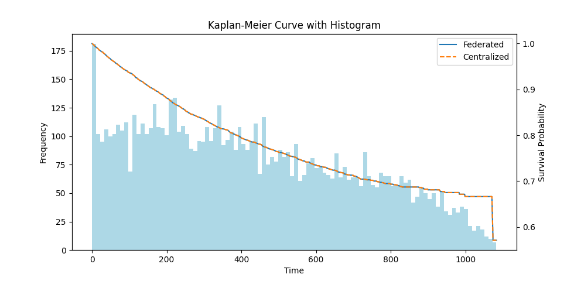

Validation
==========

A `validation script <https://github.com/vantage6/v6-kaplan-meier-py>`_ is available in
the `tests` directory. It can be run with the following command:

.. code-block:: bash

  python tests/validate_1.py

It will plot the Kaplan-Meier curve for a federated dataset and compare it with the
centralized Kaplan-Meier curve. The following figure shows the comparison of the two
curves:

  Comparison of the federated Kaplan-Meier curve with the centralized Kaplan-Meier curve.